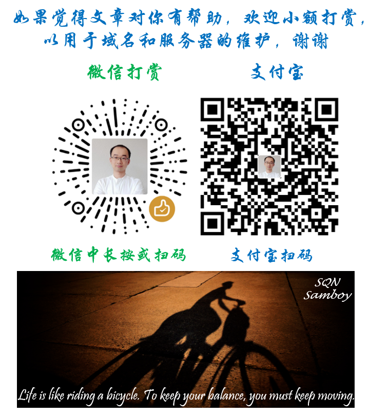

# 从瑞士彻底回国待办事项清单（todo-list）

大家好，我曾经是瑞士伯尔尼大学的博士生，因为近期彻底离开瑞士回到祖国，在这个过程中有不少需要注意和提前办理的事项，特总结在此，跟大家分享。我的基本情况是：读博四年、拿当地博士津贴、缴纳养老保险、住学生宿舍（曾长期A合同，即学期合同；临近要离开了趁着学期末改为B合同，即按月合同）。

**需要说明的是，根据每个人的情况，可能不是所有人都涉及以下所有事项，也有可能有其他事项我没有涉及到；同时由于遇到的工作人员不同，具体操作也可能不同；因此特别声明以下内容仅供参考。以下内容基本参照我办理时候的时间顺序，事项后边的日期是我办理的日期，也仅供参考。**

~~**注1：**因为现在（2020年8月）是疫情特殊时期，乘飞机回国还需要在“健康码国际版”小程序打卡14天，并且瑞士回国的航班从9月1日起需要提交核酸检测阴性证明。请注意打卡和及时关注相关政策更新。~~

**注2：**9月1日起从瑞士回国需要提交核酸检测阴性证明，不再需要打卡，详细信息可以看大使馆的这篇文章 [20200908《关于在瑞士实施凭核酸检测阴性证明登机常见问题的说明》](https://mp.weixin.qq.com/s/cVd9dhAS3LOs5KsYhpZ1og)

**注3：**关于从希腊转机回国的核酸检测说明，请参考[《月底从希腊回国须核酸检测，来了解一下流程》](https://china.greekreporter.com/%E6%9C%88%E5%BA%95%E4%BB%8E%E5%B8%8C%E8%85%8A%E5%9B%9E%E5%9B%BD%E9%A1%BB%E6%A0%B8%E9%85%B8%E6%A3%80%E6%B5%8B/)总结下来就是，只要按着上一条注意事项中说的相关规定进行核酸检测，也是符合从希腊转机回国的相关要求的。

**注4：**目前（2020年9月）入境希腊依然需要航班起飞前至少24小时以上填写一个希腊政府提供的在线表格。表格的链接会提前发送到你订机票时候预留的邮箱，请注意查看。在完整填写后，会在登机当天的午夜收到一个二维码。在从瑞士去希腊的航班的登机口会检查此二维码，如果没有会被拒绝登机。但是对于经希腊转机的情况，没有二维码通常也可以放行。我之前没有注意到这个信息（购票时候邮箱地址写错了，没收到链接），直到要去check in了我才知道。不过因为我从希腊转机去北京，经过沟通依然同意我登机了。可能会被要求出示联程航班信息、核酸检测证明，健康码国际版可能也有帮助。（个人建议还是提前在线填写希腊的表格并获得二维码，避免潜在风险。）

## **修改SBB半价卡HA的自动续期（以及取消半价卡）**

1. 对于长期在瑞士居住的人，HA通常为自动续期
2. 如果不在取消期限内取消合同，则HA会被自动续期一年，强制缴费
3. 详细信息可以参见[这](http://www.qingnansun.de/bernlife/)[里](http://www.qingnansun.de/bernlife/)的重要事项的第4条
4. 我的半价卡于6月份到期，我提前取消了自动续期，并彻底取消了合同。
5. Check: 4月8日

## **修改宿舍合同（A到B，学期合同到按月合同）**

1. 学期合同在学期结束前1个月以前修改为B合同（或取消），否则自动延一个学期，就麻烦了。
2. 因为我在学期合同结束后需要多住一个月，所以先办了修改为B合同。
3. 最好纸质提交并要求确认信（不过Anyway会给发新合同签字）
4. Check：7月19日

## **申请取回养老保险第二支柱（BPK的部分）**

1. 可以提前办理，申请表会注明从什么时候开始实施，参见[LINK](https://qingnansun.gitbook.io/articles/getback-pension)
2. 如果已婚的话需要夫妻共同现场签字
3. 留IBAN等银行信息的话，最好使用Sparkonto（saving account）。我会在后边银行卡的部分讲解。
4. Check1：签字 - 7月30日
5. Check2：提交离境证明 - XXX

## **购买回国机票**

1. 提前几个月看到合适的就可以买
2. 我本来等国航的瑞士直航，所以拖着一直没买
3. 最后还是买了从雅典转机的航线
4. **注意：**如果是非新冠疫情期间的正常情况下，瑞士外管局可能会要求必须直飞回国，因为凭离境证明无法在申根国家转机（法兰克福机场说可以转机，法兰克福机场警察说不可以转机。有被德国警察罚款的先例，所以请自己提前确认好，必要的话在瑞士办一个短期的申根签）
5. Check：7月31日

## **取消宿舍合同**

1. 宿舍的合同需要在到期前至少一个月取消
2. 最好纸质提交并要求给予确认信，存档留凭
3. 如果你在外边租房，也要提前弄清楚需要在合同到期前多久取消合同。如果错过了取消期限，合同可能无法取消，需要自己白交一个月或者多个月房租。
4. Check：8月18日
5. Receive确认信：8月19日

## 废旧衣物回收

1. 不少同学临走了可能都有很多衣服和鞋子要回收，可以参考以下途径。
2. 小区附近一般都有回收衣服和鞋子的很高的大铁箱子，如果衣服和鞋子的状态比较好的话，可以捐到这里，用袋子装起来并封好。不知道位置的话可以找周围的人问一下。
3. 另外，衣服（不含鞋子）可以装到袋子里送到H&M里边，跟收银员说一下然后放入回收箱。每袋衣服可以换5瑞郎的代金券。每人每天在一家店可以最多换2张（可以送很多包，但是最多给2张券）。衣物、袜子、布料、抹布什么的都可以，个人建议袜子和抹布这种最好自己做一个初步的清理。详细信息可以看[这里](https://hmgroup.com/sustainability/circular-and-climate-positive/recycling.html)。

## **联系邮寄大件行李回国**

1. 可以通过瑞士老田的“集运直邮”进行邮寄，价格比较好
2. [具体页面在这](https://www.ruizhiyou.com/product/ems_pick_delivery/)，尽量不要选择现金付款
3. 老田的微信可以在学联群问一下
4. 最重30kg，价格170瑞郎
5. 箱子尺寸最大60\*60\*100cm
6. 箱子**不要**装的紧卡重量，因为后面老田需要在箱子上贴运送单
7. 建议的重量是富余0.4公斤左右，考虑到家里的称和邮局的称可能也有偏差
8. 避免在地毯上称重，最好在地砖等硬地面上进行称重，否则读数可能不准
9. 我的第一个包裹在家称29.3或29.4kg，最后邮局给的重量也是29.4kg，还比较一致
10. 老田周五把包裹统一送到邮局之后会给一个单号用来跟踪，周六开始可以在post.ch跟踪，晚些到国内后ems.com.cn或其他第三方快递跟踪网站信息更全。
11. 如果几天后查询还没有到苏黎世海关出口状态，联系老田或邮局一下，看是不是因为有违禁物品导致退运。
12. 网上最好查一下哪些东西应该避免邮寄回国，详细了解自己寄了什么
13. 理论4到8天，一般2周左右可以寄到，疫情期间可能会更久一些
14. 我的第一箱在青岛海关留存待验后通过微信缴费约250RMB（含50的手续费）之后两天内即放行。
15. 网上缴费属于通过邮局代办，需要交50的手续费。如果自己去海关缴费的话可以省下这50，但是要自己把包裹拿回家。
16. Check1：8月28日寄送-经历海关留存和缴费清关-9月16日收到
17. Check2：9月18日寄送-

## **从原单位开一个工作经历证明**

1. 听说国内有的单位在某些情况下需要
2. 不过anyway可以从原单位开一个包含读书/读博/博后/工作的证明文件
3. 有的单位在员工离职的时候，本来就是有相应的证明文件的（Arbeitszeugnis, Praktikumszeugnis等）
4. Check：9月23日拿到

## **联系使馆文教科处办理留学回国证明**

1. [办理回国证明的官方说明链接](http://swiss.lxgz.org.cn/publish/portal64/tab4128/info78671.htm)
2. **最新：**从2020年11月1日起国家取消了留学回国证明，具体信息请查看相关新闻和政策。
3. 最好提前1到2个月办理，回寄地址为瑞士境内地址。
4. 建议先提交在线申请，然后尽快把所需电子版材料发给文教科处的分管老师
5. 博士的毕业证书名称一项统一为：**Doctor**
6. 居留许可证明需要在瑞士期间的全部居留许可，如果毕业后又在瑞士待了一段时间，这部分的居留许可也需要。
7. 在线申请时需要填写“留学期限”。如果有多段留学经历，建议以其中一段，比如最高学历来填写留。同时在备注中可简要说明此前曾在XXX留学。
8. 对于来瑞士之前在其他国家的留学经历，可提供毕业证书及在的学习时间。必要时老师们会联系你核实。
9. 如果博士毕业后曾继续进行了短期（几个月）的研究工作，也可以在备注中说明。
10. 多段留学经历的备注样例：XXX于20XX年X月至20XX年X月在XXX大学学习并获硕士学位，后于2014年12月至2016年3月在该校从事研究工作。20XX年X月至X月在伯尔尼大学从事研究工作。
11. 备注可以您可自行酌量修改，以简洁、信息准确为佳
12. **备注字数最多不要超过90个字，最好控制在80字以内**。老师们是从系统里进行打印，无法调整备注的边距和字体等，如果字数太多，会直接截断，无法完整打印。
13. Check：8月20日
14. Receive：9月24日（期间我的备注写的太长返工耽误了些时间）

## **申请取回养老保险第一支柱（AHV部分）**

1. 参见[LINK](https://qingnansun.gitbook.io/articles/getback-pension)
2. 我本来想把AHV这部分由机构直接转回我国内的外币账户，后来因为了解到可以保留Postfinance的Sparkonto，而且免费，所以决定也转到Postfinance的Sparkonto中。（参见后边关于取消银行卡的部分）
3. 我是走之前把申请材料准备好了放在信封里，托朋友在我顺利回国之后再寄送（怕万一因为各种原因走不了）。

## **办理离境证明**

1. 有些包年的套餐，如电话卡、保险等需要离境证明才可以免费取消
2. 对于需要退养老保险的人，离境证明也是必须的材料
3. 但是无论如何，最好都办一下离境证明，以防以后需要该材料
4. 可以去现场，也可以[在线办理](https://www.eumzug.swiss/eumzug/#/case/d995672f-0b91-4e0f-b638-463d2ec4b186/personIdentifikation)（非欧盟居民都不收费）
5. 之前有同学是在线办理的，现在（2020年9月）网上系统已经跟之前不同了，改版之后要填写的新地址只能为瑞士境内的地址，否则有一个与地址对应的码无法显示（不是浏览器的原因），以至于无法进行下一步。也许以后会好，不过因为目前我没法使用，我就去了现场办理。
6. 之前在线办理的同学的permit没有收回去，离境证明邮寄给她的
7. 我去现场办理，现场拿到离境证明。本来是要把我的permit收回去，但是我说明了一下我要去雅典转机，所以工作人员把permit还给我了（permit还在有效期内），以便我在申根国家转机。
8. **注意1**：在新冠疫情之前，曾经陪同学去办理过离境证明，当时工作人员要求航班必须为从瑞士直飞回国，或者从中国人不需要办签证的国家转机。因为当时他们无论如何都会把permit收回去。所以如果以后新冠疫情结束了，具体是否可以通过转机回国，请和工作人员仔细确认。
9. **注意2**：在新冠疫情期间，有同学去申根国家转机，因为permit已经到期，在瑞士提前办理了申根签证，得以成功转机。
10. **注意3**：有同学询问法兰克福机场，如果没有permit但是有离境证明是否可以转机。机场的咨询电话说可以，但是机场海关的咨询电话说不行。据说曾有同学因为只携带离境证明转机，被法兰克福机场海关罚款的。所以保险期间，请仔细确认清楚。如果可能的话，避免只携带离境证明在申根国家转机。
11. Check：9月21日

## **下载信用卡和银行卡电子对账单**

1. 电子对账单下载留存后以便以后必要时核对和出示

## **取消信用卡**

1. 信用卡有的需要发纸质的信件取消，有的通过传真或者直接打电话即可取消
2. 信用卡的对应联系电话和地址在卡的反面有写
3. 我的信用卡和取消方式列在后文了，仅供参考
4. A. Swisscard: 一张是和coop合作的，一张是信用卡公司与coop合作解除后新发的。我打电话过去询问，对方验证身份后，说会在5个工作日内有相应部门的人给我打电话并确定注销信用卡的时间。
5. B. Topcard: 与coop合作的信用卡，必须寄信注销信用卡。如果是即时生效，需要把信用卡剪碎一并寄回，如果是寄信后一段时间生效，可以不寄回信用卡。\(0827寄信希望9月底取消\)
6. C. Amazon LBB: Amazon和LBB银行的合作卡，需要寄信注销信用卡。\(0827寄信希望9月底取消---因为我的卡每年10月收年费\)

## **取消银行卡**

1. 银行卡可以提前办手续取消，并约定从什么时候开始正式销户。
2. 以我的Postfinance的银行账户为例，包含：Privatkonto，Sparkonto, E-banking, Twint还有一张预付费的Master信用卡，一个一个说：
   1. Privatkonto就是平时来回存取钱的，这个在离境之后手续费为25瑞郎每月，所以我给约定在9月30日进行销户，销户那天Privatkonto里的钱会转到我的Sparkonto里。
   2. 同时把预付费的信用卡约定在9月30日进行销户。对于预付费的卡，里边的余额无法退还，所以要在销户前花完。
   3. Sparkonto是一个**免费**的存钱账户，由于养老保险第二支柱的取回必须用瑞士境内的银行（第一支柱可以境内也可以境外），所以保留了这个账户。这样回国之后依然可以通过E-banking在线操作，比如把里边的钱转到其他国家或者转回国。唯一需要注意的是，Sparkonto每年的转出是有条件的，Postfinance的Sparkonto每年只能往外转10次。其他银行也各有自己的要求。
   4. 如果你还有其他的银行卡，并且在离境前也进行了销户，里边的钱你可以自己转出来，或者要求银行转到你其他的银行卡，我这里也是留的自己的Sparkonto作为接收账户。
   5. 在Sparkonto接受到了所有的养老金后（比如第一和第二支柱），就需要跟银行说明注销该账户，网上即可以办理。（问了工作人员，不能无限期持有该Sparkonto）
   6. Twint没问。。。
3. Check: 9月21日

## **取消电话卡**

1. 和相应通信公司邮件或电话联系，或现场办理
2. 我用的电话卡不涉及月费，不涉及此项

## **取消保险**

1. 和相应保险公司邮件或电话联系
2. 通常需要提供离境证明，我是在顺利回国之后联系的。

## **邮寄地址更改**

1. 如果还有一些信件会寄到你瑞士的地址，可以提前和相关机构联系把地址改成一个在瑞士朋友的地址，比如你是ABC， 同学是XYZ， 那你可以把地址改为：“ABC， c/o XYZ， XYZ的地址”
2. 或者也可以在邮局办理Nachsendeauftrag（Nachsendung）, 把寄到你目前地址的信件转寄到另一个地址，不限于瑞士的地址，邮局的工作人员和我说费用是一年40瑞郎（我没有办理，觉得不是特别必要）
3. 或者直接在post的网站修改也行，前提是你要在post官网免费注册一个用户，然后在[kundencent](https://www.post.ch/de/kundencenter/kundencenter)修改即可（Mein Profil中的“Umzug melden”中，需要验证手机号）。修改时需要一些必要的关于搬家以及新地址的信息，也是不限于瑞士的地址，我看网上还可以选中国。在网上看到的费用是30瑞郎（我依然没有办理）。

## **退订各类（免费）报纸，如coop等**

1. 在报纸上写的或者网上搜索的联系邮箱发邮件退订。
2. 如果订阅了人民日报（海外版），可以通过当地学联联系退订。最好提前办理，因为是按季度统计的。
3. Check: 9月15日

## **进行核酸检测**

1. 伯尔尼的同学可以到Inselspital急诊（[Notfallzentrum](https://www.insel.ch/de/patienten-und-besucher/coronavirus/)）对面的COVIDtrack进行测试
2. 不需要预约，周一到周日，10点到17点开门，直接去就行。我当时是11点左右去的，排队大概1个小时
3. 如果你有Insel的工作合同（是Insel的员工），可以优先测，而且不要钱
4. 如果你有症状的话，是通过保险直接付款。
5. 我不是Insel的员工（只有大学的合同），也没有症状（因为是为了回国而进行检测），所以需要自己付钱。可以先到急诊中心付款然后再测，也可以通过账单的方式在之后付款。
6. 最晚48小时之内会出结果，不过一般都比较快，我是11点左右测的，当天晚上8点多就拿到了结果。
7. 检测结果是通过短信发送的链接查询
8. 拿到检测结果之后，截图保存，并尽快上传到微信小程序健康码国际版中，等待使馆审核。
9. 审核通过后会得到绿色健康码
10. 如果审核过程中有什么困难，可以及时和使馆领侨处的老师联系寻求帮助。
11. Check：检测 - 9月23日11点
12. Check：收到结果 - 9月23日20点
13. Check：获得绿码 - 9月24日10点

## **后记&致谢**

目前我已经顺利抵达国内并在北京五环外的酒店过上了隔离生活。说实话，从踏上雅典到北京的飞机开始，心里终于踏实了。 因为我在回国过程中在时间等方面有一些比较特殊的情况，所以在手续准备的时候考虑了非常多的方案，当然也因此不断咨询和“骚扰”了很多在这之前回国的朋友。特别感谢在此过程中不断被我“骚扰”的：XL同学，XD同学，XJ师妹，LSC同学。同时也衷心感谢驻瑞士使馆文教科处和领侨处老师们的帮助和支持。

